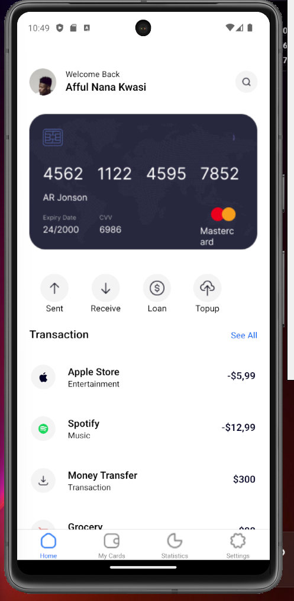
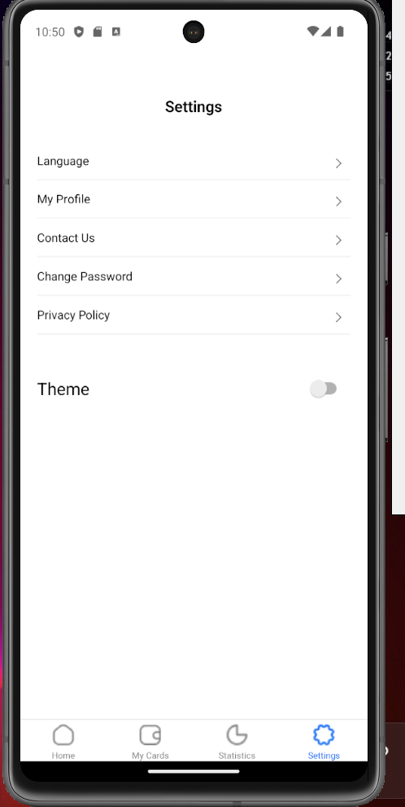
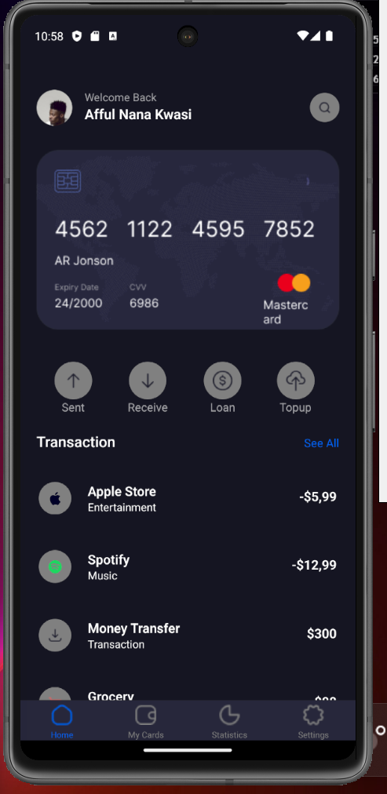
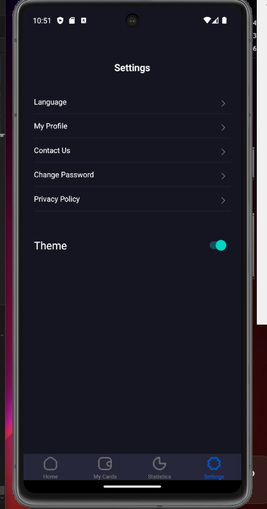

# ID - 11091069

# React Native Assignment 5

# Mobile Application UI Design Recreation

## Project Overview
This project aims to recreate the design as seen in the provided UI mockup. The application includes the following key features:

- **Bottom Tab Navigation**: Implemented screens accessible via bottom tabs, focusing on the Home and Settings screens.
- **Theme Switching**: A feature allowing users to switch between light and dark themes, matching the UI design specifications.
- **Styling**: The application is styled to closely match the provided UI design.
- **Custom Components**: Custom components are used throughout the application to ensure consistency and reusability.

## Features
1. **Bottom Tabs Navigation**
   - Home Screen
   - Settings Screen

2. **Theme Switching**
   - Light Theme
   - Dark Theme

3. **Styling**
   - Closely matches the provided UI mockup

4. **Custom Components**
   - Reusable components to maintain consistency

## Screenshots

